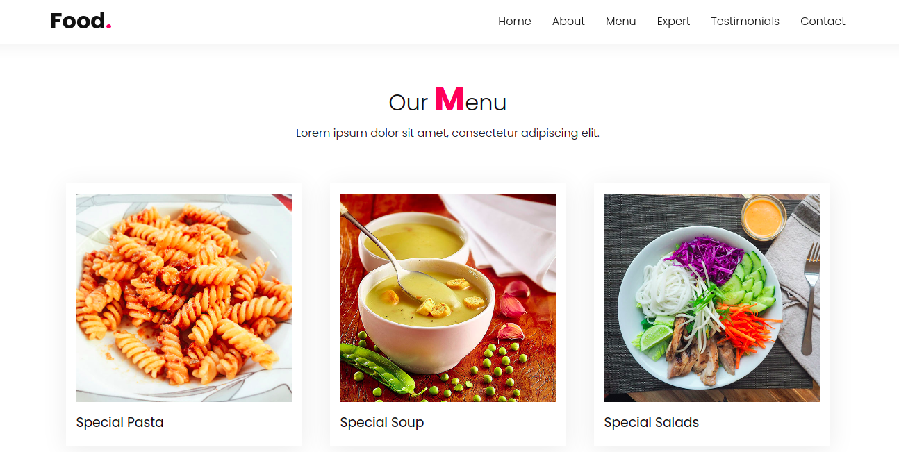

<h2 align="center">
  Food Responsive Website
</h2>

<p align="center">
  

  

  
</p>

<br>

### :writing_hand: About this project
A website template with a restaurant theme, I used in this small project technologies such as HTML5, CSS3 and a little Javascript, the project aimed to practice my knowledge with responsiveness and css styling techniques


### :cyclone: How to run this project
```bash
# Clone this repository
$ git clone https://github.com/jefferson1104/food-responsive-website

# Access the project folder
$ cd food-website

# Open 'index.html' with your browseror

```
### 🎨 Screenshot
<p align="center">
  
  
  
</p>